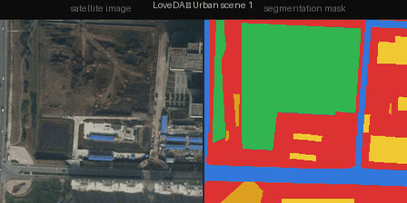

# Satellite Image Segmentation with Pretrained Models



Neural Networks project — **does pretraining on satellite imagery improve land-cover
segmentation when labels are scarce?** Two complementary studies on remote-sensing data.

| | Study 1 — Pretraining (main) | Study 2 — Sensor fusion (secondary) |
|---|---|---|
| **Dataset** | LoveDA (RGB aerial, 7 classes) | DFC2020 (Sentinel-1 + Sentinel-2, 8 classes) |
| **Question** | satellite pretraining vs scratch, in data-scarce setting | multispectral + radar; SatMAE++ pretraining vs random |
| **Backbones** | Swin-T U-Net (RSP), ViT-L (SatMAE++ fMoW-RGB) | ViT-L group-channel (SatMAE++ fMoW-Sentinel) |
| **Entry point** | `main.py` | `task2_multispectral.py` |

A full technical report (models, weights, comparisons, dataset-switching guide) is in **`Report_Tecnico_NN.docx`**.

---

## Quick start (Google Colab, GPU T4)

> All experiments were run on Google Colab free tier (T4 GPU). Open a new notebook and run the cells below in order.

### 1 — Clone the repo and install dependencies

```bash
%cd /content
!git clone https://github.com/giorgio0420/NN_segmentation.git
!git clone https://github.com/techmn/satmae_pp.git        # needed for Study 2 only
%cd NN_segmentation
!pip install segmentation-models-pytorch tifffile timm torchgeo
```

### 2 — Download pretrained weights

```python
# Swin-T RSP weights (Study 1)
!gdown 1G5wjbjIHepmT6VVOuW03bWmyvrhcfe1F -O rsp-swin-t-ckpt.pth

# SatMAE++ ViT-L fMoW-RGB (Study 1 — ViT mode)
from huggingface_hub import hf_hub_download
RGB_CKPT = hf_hub_download("mubashir04/checkpoint_ViT-L_pretrain_fmow_rgb",
                            "checkpoint_ViT-L_pretrain_fmow_rgb.pth")

# SatMAE++ ViT-L fMoW-Sentinel (Study 2 only)
SEN_CKPT = hf_hub_download("mubashir04/checkpoint_ViT-L_pretrain_fmow_sentinel",
                            "checkpoint_ViT-L_pretrain_fmow_sentinel.pth")
```

> The datasets (LoveDA and DFC2020) are downloaded **automatically** on first run via torchgeo / HuggingFace — no manual download needed.

### 3 — Run Study 1 (LoveDA, pretraining ablation)

```bash
# scratch baseline
!python main.py --mode scratch  --train-subset 300 --epochs 20 --tag scratch

# Swin-T with RSP satellite pretraining
!python main.py --mode rsp      --train-subset 300 --epochs 20 --tag rsp

# ViT-L with SatMAE++ pretraining (frozen encoder)
!python main.py --mode satmaepp --train-subset 300 --epochs 20 --tag satmae
```

Results are saved to `results_summary.csv`. To run the full ablation grid (all modes + wavelet variants):

```bash
!python run_ablation.py
```

### 4 — Run Study 2 (DFC2020, sensor fusion)

```bash
# SatMAE++ pretrained — multispectral only
!python task2_multispectral.py --model satmae --ckpt {SEN_CKPT} --bands msi \
    --class-weights --ft-blocks 4 --lr 1e-4 --tag satmae_pre

# Random init baseline — multispectral only
!python task2_multispectral.py --model satmae --bands msi \
    --class-weights --ft-blocks 4 --lr 1e-4 --tag satmae_rand

# SatMAE++ pretrained — multispectral + radar (Sentinel-1)
!python task2_multispectral.py --model satmae --ckpt {SEN_CKPT} --bands msi_sar \
    --class-weights --ft-blocks 4 --lr 1e-4 --tag satmae_pre_sar
```

---

## Repository structure

```
main.py                      # Study 1: training/eval/ablation (modes, input scale, wavelet)
config.py                    # hyperparams, dataset paths
run_ablation.py              # Study 1: grid runner → results_summary.csv
data/dataset.py              # LoveDA via torchgeo
data/transforms.py           # resize|crop preprocessing + wavelet augmentation
models/lightweight_unet.py   # Swin-T U-Net (scratch / imagenet / RSP)
models/satmaepp_segmenter.py # SatMAE++ ViT-L fMoW-RGB (frozen) + decoder
models/rsp_wavelet_unet.py   # Swin + wavelet-detail decoder (wavelet ablation)
utils/engine.py, plots.py    # train/eval loops, metrics (mIoU / Dice), figures
task2_multispectral.py       # Study 2: DFC2020 loader + SatMAE++-Sentinel / ResNet U-Net
satmae_sentinel.py           # SatMAE++ ViT-L group-channel (frozen) + decoder
```

## Pretrained weights

| Backbone | Source |
|---|---|
| Swin-T **RSP** (MillionAID) | Google Drive `1G5wjbjIHepmT6VVOuW03bWmyvrhcfe1F` → `rsp-swin-t-ckpt.pth` |
| **SatMAE++** ViT-L fMoW-RGB | HF `mubashir04/checkpoint_ViT-L_pretrain_fmow_rgb` |
| **SatMAE++** ViT-L fMoW-Sentinel | HF `mubashir04/checkpoint_ViT-L_pretrain_fmow_sentinel` |

---

## Key findings

- **Pretraining helps in data-scarce settings** (LoveDA, n=300): SatMAE++ frozen ≈ **0.31 mIoU**, RSP ≈ 0.25, scratch ≈ 0.09.
- **Class-weighting** recovers rare classes (road / water) — large mIoU gain.
- **Wavelet** strategies rigorously evaluated (input + decoder, Swin + ViT) → **neutral** on semantic segmentation; bottleneck is semantics, not frequency content — an explained negative result.
- **Multispectral + radar** (Study 2, DFC2020): SatMAE++-Sentinel pretrained > random; radar (S1) specifically aids water-class segmentation.

---

## References

SatMAE++ — Noman et al., CVPR 2024 · RSP — ViTAE-Transformer · DFC2020 — GFM-Bench
